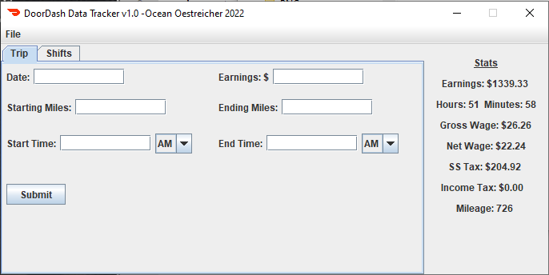
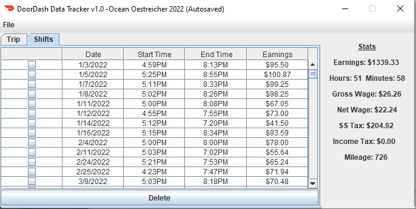

# DoorDashGui
This application was created by Ocean Oestreicher

The purpose of this application was to allow a user to keep track of their shifts when working a gig job and see what their total earnings are as well as gross wage and net wage. It also will give a rough estimate of the income tax and social security tax the user could expect to pay.

The application allows a user to delete their shifts and will automatically sort any new shift according to its date.

